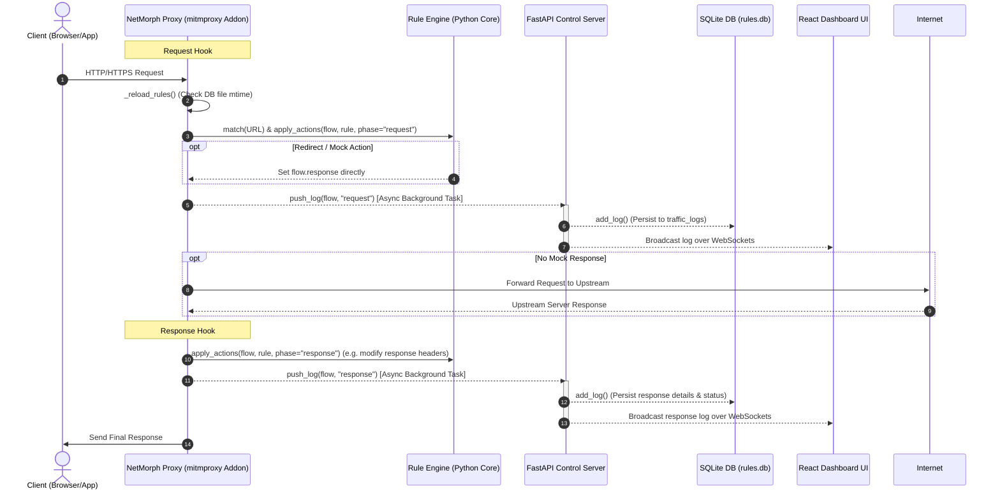

# NetMorph: Local-First Programmable MITM Proxy

**Business Problem Statement:**
**Modern web and mobile application development is frequently bottlenecked by backend dependencies, unreliable staging environments, and the difficulty of simulating edge cases (such as high network latency, API failures, or custom response payloads) during client-side testing. Teams waste hundreds of engineering hours waiting for API changes, staging servers to be updated, or manual mock data generation. NetMorph solves this by providing a local-first, programmable MITM proxy and control engine that puts developers in total control of the network layer. Developers can instantly mock, redirect, and modify requests/responses on-the-fly, allowing front-end and QA teams to run full-fidelity validation with zero backend dependency.**

NetMorph is a high-performance, developer-centric network manipulation tool. It acts as a local interceptor, allowing you to control and mutate HTTP/HTTPS traffic through a programmable rule engine and visualize all actions in real-time via a modern React dashboard.

---

## ⚙️ System Architecture

The following diagram illustrates how NetMorph intercepts traffic, executes programmable rules in different phases, and streams logs to the dashboard UI without blocking the network thread:



---

## 🚀 Key Features

* **HTTPS Interception**: Complete SSL/TLS decryption using local CA certificate trust.
* **O(1) Rule Matcher**: Pre-compiled exact-matching path combined with compiled regex fallback.
* **Programmable Core**: Support for redirect rules, custom mock responses, header modifications, and sandboxed Python script hooks.
* **Response Modification Support**: Multi-phase execution allows modifying requests as well as real response payloads and headers from upstream servers.
* **Workspace Isolation**: Logical partitioning of interceptors for different projects (e.g., Development, QA, Staging).
* **Live Network Logs**: Real-time traffic monitoring via WebSocket streaming to the dashboard.
* **CLI Management**: Fully featured Command Line Interface (`netmorph`) to configure and list rules.

---

## 🛠 Tech Stack

| Layer | Technology | Rationale |
|---|---|---|
| **Proxy Interceptor** | `mitmproxy` (Python) | Production-grade traffic decryption, cert generation, and stream handling. Saves ~20k LOC. |
| **Control Backend** | `FastAPI` (Python) | Async lifecycle management, lightweight endpoints, and native integration with the Python rule core. |
| **Database** | `SQLite3` (via `aiosqlite`) | Zero-configuration, local-first database to maintain rules and traffic logs with async execution. |
| **Dashboard UI** | `React` + `TypeScript` + `Vite` | Fast HMR, premium styling utilizing HSL CSS, and robust state checking for Monaco/code components. |
| **CLI App** | `Typer` + `Rich` | Clear terminal UI, formatted tables, and intuitive CLI workflow. |

---

## ⚡ Technical & Engineering Highlights

### 1. High-Performance, Non-Blocking Log Streaming
Pushing logs to the database during request interception can introduce critical network latency. NetMorph optimizes this by invoking the logging API in an asynchronous background task (`asyncio.create_task`) rather than awaiting it on the main proxy thread. This keeps rule-matching and proxy execution overhead below **5ms**.

### 2. Workspace-Safe Rule State Updates
Toggling rule activity status through standard `INSERT OR REPLACE` operations risks discarding the associated `workspace_id` when the frontend states are flat-mapped. To prevent rule migration back to the default workspace on toggle, NetMorph uses targeted in-place database queries:
```sql
UPDATE rules SET is_active = ? WHERE id = ?
```

### 3. Context-Aware Phase Processing
Rules are evaluated in two distinct phases. Request-related actions (like redirects and mocks) run during the `request` hook. Response-related actions (like response header injection) are held until the `response` hook, where `flow.response` is guaranteed to be available, preventing `NoneType` attribute crashes.

---

## 🏁 Getting Started

### Prerequisites
- Python >= 3.13
- Node.js & npm
- `uv` (recommended Python package manager)

### 1. Backend & Proxy Setup
Install dependencies and initialize the SQLite database:
```bash
# Install Python packages
uv pip install -e .

# Initialize NetMorph database
uv run netmorph init
```

Start the FastAPI control API:
```bash
uv run uvicorn core.api:app --host 0.0.0.0 --port 8000
```

Start the mitmproxy interceptor:
```bash
uv run mitmdump -s proxy/addon.py -p 8080
```

### 2. Trust the CA Certificate (Required for HTTPS Interception)
Run the script to trust mitmproxy's certificate in your system store (requires Administrator privileges on Windows):
```powershell
powershell -ExecutionPolicy Bypass -File scripts/trust_cert.ps1
```

### 3. Dashboard UI Setup
Navigate to the dashboard directory, install packages, and start the development server:
```bash
cd dashboard
npm install
npm run dev
```
Open your browser at `http://localhost:5173`.

---

## 🧪 Testing & Verification

NetMorph has a robust test suite covering database operations, engine transformations, CLI functionality, and REST API endpoints.

To run the full suite:
```bash
uv run pytest
```

Test coverage includes:
* `tests/test_api.py`: REST API endpoints utilizing isolated `TestClient` databases.
* `tests/test_cli.py`: Typer CLI command validation.
* `tests/test_engine.py`: Request/Response header changes and phase-based script execution.
* `tests/test_db.py`: CRUD operations and workspace persistence.
* `tests/test_matcher.py`: O(1) exact matching and regex fallback logic.
